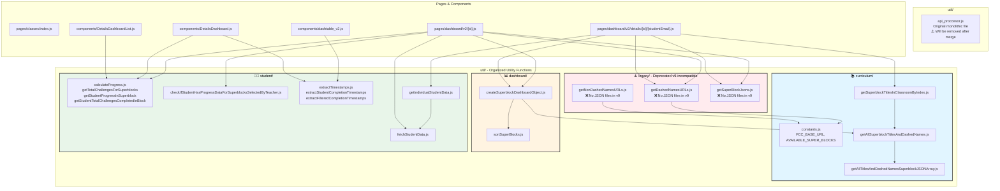

```mermaid
graph TD
    subgraph root["util/"]
        original[api_proccesor.js<br/>Original monolithic file<br/>⚠️ Will be removed after merge]
    end

    subgraph "util/ - Organized Utility Functions"
        subgraph curriculum["📚 curriculum/"]
            curr1[constants.js<br/>FCC_BASE_URL, AVAILABLE_SUPER_BLOCKS]
            curr2[getAllTitlesAndDashedNamesSuperblockJSONArray.js]
            curr3[getAllSuperblockTitlesAndDashedNames.js]
            curr4[getSuperblockTitlesInClassroomByIndex.js]
        end

        subgraph dashboard["📊 dashboard/"]
            dash1[createSuperblockDashboardObject.js]
            dash2[sortSuperBlocks.js]
        end

        subgraph student["👨‍🎓 student/"]
            stud1[calculateProgress.js<br/>getTotalChallengesForSuperblocks<br/>getStudentProgressInSuperblock<br/>getStudentTotalChallengesCompletedInBlock]
            stud2[checkIfStudentHasProgressDataForSuperblocksSelectedByTeacher.js]
            stud3[extractTimestamps.js<br/>extractStudentCompletionTimestamps<br/>extractFilteredCompletionTimestamps]
            stud4[fetchStudentData.js]
            stud5[getIndividualStudentData.js]
        end

        subgraph legacy["⚠️ legacy/ - Deprecated v9-incompatible"]
            leg2[getDashedNamesURLs.js<br/>❌ No JSON files in v9]
            leg3[getNonDashedNamesURLs.js<br/>❌ No JSON files in v9]
            leg4[getSuperBlockJsons.js<br/>❌ No JSON files in v9]
        end
    end

    subgraph pages["Pages & Components"]
        page1["pages/classes/index.js"]
        page2["pages/dashboard/v2/[id].js"]
        page3["pages/dashboard/v2/details/[id]/[studentEmail].js"]
        comp1["components/dashtable_v2.js"]
        comp2["components/DetailsDashboard.js"]
        comp3["components/DetailsDashboardList.js"]
    end

    %% Dependencies
    curr3 --> curr2
    curr4 --> curr3
    dash1 --> curr3
    dash1 --> dash2
    stud5 --> stud4
    leg2 --> curr1
    leg3 --> curr1

    %% Page imports
    page2 --> dash1
    page2 --> stud1
    page2 --> stud2
    page2 --> stud4
    page2 --> leg2
    page2 --> leg4
    page3 --> dash1
    page3 --> curr4
    page3 --> stud5
    page3 --> leg2
    page3 --> leg4
    comp1 --> stud3
    comp2 --> stud1
    comp2 --> stud3
    comp3 --> stud1

    style curriculum fill:#e1f5ff,stroke:#333,stroke-width:2px,color:#000
    style dashboard fill:#fff4e1,stroke:#333,stroke-width:2px,color:#000
    style student fill:#e8f5e9,stroke:#333,stroke-width:2px,color:#000
    style legacy fill:#ffebee,stroke:#333,stroke-width:2px,color:#000
```
